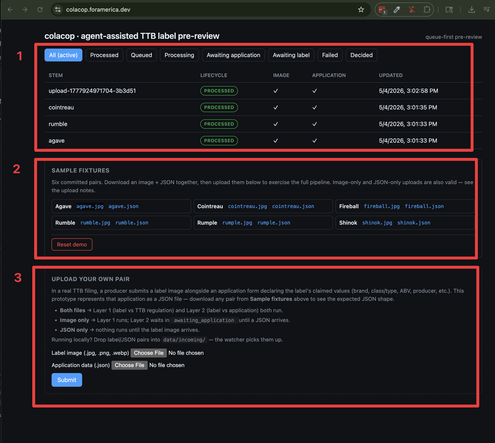
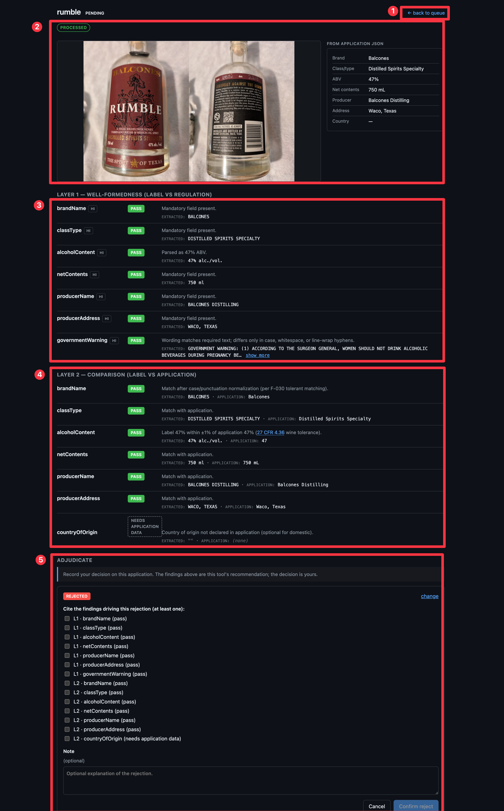

# colacop — agent-assisted TTB label pre-review

> **Live demo:** [https://colacop.foramerica.dev](https://colacop.foramerica.dev) — no login required.

A take-home prototype for the TTB IT Specialist position. The tool reads alcohol-label images, screens them against TTB regulation and the producer's application data, and produces a structured set of findings — each with a CFR citation — that a TTB specialist can accept, override, or amend.

This is **agent-assisted pre-review**, not automated review. The regulatory action of record (approve / reject / send back) is the specialist's, exercising delegated authority. The tool's job is not to be right — it is to be *right about why it might be wrong*. A finding like "alcohol content statement may violate 27 CFR 4.36(b)(1) because [reason]; confidence medium" lets a specialist adjudicate in seconds; "rejected" forces them to redo the work. When the specialist's adjudication diverges from the tool's recommendation, that's surfaced as an **override** — itself valuable signal. See `ARCHITECTURE.md` § Tool Positioning & Vocabulary for the canonical vocabulary (verdict vs decision, recommendation vs review).

## Approach

The prototype follows a deliberate source → fact → requirement → architecture pipeline:

- The original assignment is preserved in `assignment.md`.
- Stakeholder interview material is split into individual citable source files under `discovery/sources/`.
- Facts extracted from those sources live in `discovery/facts.yaml` with provenance, authority context, and tags.
- Requirements derived from fact clusters live in `design/requirements.yaml`.
- Architecture decisions are captured in `ARCHITECTURE.md` with explicit references back to the facts and requirements that motivated them.
- Friction encountered while building this pipeline is logged in `notes/friction.md`.

This level of process is deliberately heavier than the assignment requires; it is part of the implementer's submission, demonstrating how requirements traceability informs design.

### Provenance walk

A traced example showing how design decisions are grounded:

- **Workflow shape** — S-001 (Deputy Director of Label Compliance interview) → F-001 (≈150K reviews/year), F-004 (agents review by comparing label artwork to application data), F-006 (5–10 min per review) → REQ-001 (fast single-label review), REQ-002 (low-friction UX), REQ-003 (asynchronous processing — F-009 / F-010 record a prior synchronous vendor pilot that failed because agents had to wait interactively).
- **Two-layer verification** — S-006 + S-007 (TTB regulatory sources for the government warning text and mandatory label fields) → F-045 → REQ-011: Layer 1 well-formedness (regulation-driven) and Layer 2 comparison (label-vs-application).
- **Provider boundary** — S-005 + F-042 (Anthropic supply-chain / procurement risk for federal agencies; the Defense Secretary designated Anthropic as a supply-chain risk) → an app-owned `LabelProvider` interface in `core/providers/`, with Google Gemini 3.1 Pro as the first concrete implementation and Vertex AI Government (FedRAMP High) as the production swap path.
- **Synthesis** — REQ-001..003 + REQ-011 → **UC-001** in `design/use-cases.yaml` (Cockburn-style single user-goal use case with extensions, deliberately *not* a scattershot of UC-001/002/003) → architectural choices in **`ARCHITECTURE.md`** (queue-first UI, watcher with `awaitWriteFinish`, two-layer verifier, paired-input pairing-by-stem, swappable provider).

## What it looks like



**Queue view.** The reviewer's working surface — every label submission lives here.

1. Lifecycle filter tabs (All / Processed / Queued / Processing / Awaiting application / Awaiting label / Failed / Decided) and the live job rows. Each row shows stem, current lifecycle, presence of image and application files, and last-updated timestamp.
2. Sample fixtures panel — six committed pairs ready to download for upload, plus the **Reset demo** button which truncates the database, wipes `data/incoming/`, and reseeds the three demo fixtures through the live Gemini pipeline.
3. Upload form. Image-only or JSON-only submissions are valid; the system records what's missing and runs whichever layer it can. Local installs can also drop pairs into `data/incoming/` directly.



**Job detail view.** The whole adjudication surface for a single label.

1. Back to queue.
2. Header: stem name, lifecycle pill, label image, and the producer's application data — the comparison ground-truth.
3. **Layer 1 — Well-formedness** (label vs regulation). Per-field verdicts and CFR citations: each `pass / fail / needs_review` row points at the exact regulatory clause that produced the verdict, so the specialist can adjudicate without re-deriving the rule.
4. **Layer 2 — Comparison** (label vs application). Per-field cross-check between the extracted label values and the application's claimed values; verdicts add `needs_application_data` for fields where the JSON didn't supply a value.
5. **Adjudicate** panel. Per-finding acknowledgment checkboxes, the three label-level decisions (Approve / Reject / Send back), and a free-text note. The label-level decision is the regulatory action of record; per-finding overrides are deliberate future work (see Known limitations).

## What it does

The tool ingests pairs of files: a label image (`.jpg`, `.jpeg`, `.png`, `.webp`) and an application-data JSON file (`.json`) sharing the same filename stem. For each pair it produces two layers of verification results:

- **Layer 1 — Well-formedness.** Checks the label against TTB regulatory requirements that hold regardless of any application data: government warning exact text, mandatory fields present, alcohol-content format, and similar.
- **Layer 2 — Comparison.** Checks extracted label fields against the producer's application data: brand name match, ABV match, net contents match, and similar.

Files in a pair may arrive in either order. If only the image is supplied, Layer 1 runs and Layer 2 reports `needs_application_data`; if only the JSON is supplied, the job is held until the image arrives.

Submissions can be made by either dropping files into the watched `data/incoming/` directory or by uploading through the browser UI. Both paths produce the same internal representation.

Two runtime correctness properties worth flagging: the watcher's `INSERT ... ON CONFLICT (stem)` upsert handles chokidar burst-arrivals race-free at the database, and second-pass processing (JSON-after-image, or after a worker restart) rehydrates extracted fields from persisted Layer 1 rows rather than re-calling the model — one Gemini extraction per pair, not two.

## Tools used

- **Node.js 24.x** (TypeScript, strict mode).
- **React + Vite** for the SPA.
- **Express** for the HTTP API.
- **Kysely + pg** for type-safe SQL access; **Zod** for boundary validation.
- **Postgres** via Docker Compose.
- **Chokidar** for filesystem watching.
- **Google Gemini 3.1 Pro** as the vision model behind a `LabelProvider` interface — the boundary makes provider replacement straightforward (Vertex AI Government, Azure OpenAI, Bedrock would all be reasonable production swaps depending on procurement).
- **PM2** + **nginx** on the VPS.

Full stack rationale and provider choices are in `ARCHITECTURE.md`.

## Running locally

The app runs as three independent long-lived processes — the API, the watcher worker, and the Vite dev server — so local development uses three terminals. (The deployed VPS uses PM2 to manage the same processes; locally we keep it simple.)

### One-time setup

```sh
# Install Node 24.x via nodenv (uses .node-version → 24.14.0)
nodenv install

# Install dependencies
npm install

# Configure env (DATABASE_URL, ports, GEMINI_API_KEY)
cp .env.example .env
# then edit .env — at minimum set GEMINI_API_KEY for real label extraction.
# Without it the worker silently falls back to a stub provider that returns
# canned fixture data — check the worker log for "[worker] provider: ...".

# Start Postgres
docker compose up -d db
# If port 5432 is already in use on your machine, set POSTGRES_PORT=5433
# (or similar) in .env and update DATABASE_URL to match.

# Run migrations
npm run migrate

# Optional: seed the demo fixtures
npm run seed:demo   # copies agave / cointreau / rumble into data/incoming/
```

### Run

In three separate terminals:

```sh
# terminal 1 — API
npm run dev:server

# terminal 2 — watcher worker
npm run dev:worker

# terminal 3 — Vite dev server
npm run dev:web
```

Run only **one** worker. Single-writer is enforced operationally (PM2 in production, your discipline locally); two workers against the same database and `INCOMING_DIR` will race.

Open the URL Vite prints (typically `http://localhost:5173`).

### Verify it works

Drop a paired fixture into the watched directory:

```sh
cp fixtures/pairs/cointreau.* data/incoming/
```

Within a couple of seconds the worker logs that it's processing the pair, and the queue in the UI shows a new job moving through `queued` → `processing` → `processed` with extracted fields and per-field findings. Browser upload through the UI exercises the same code path.

## How the live deployment is updated

```sh
ssh root@colacop.foramerica.dev
cd ~/colacop
git pull
npm ci
npm run migrate
npm run seed:demo
npm run build
pm2 reload ecosystem.config.cjs
```

Manual deploy by design — for a short prototype build, iteration speed beats CI/CD ceremony.

`seed:demo` copies agave / cointreau / rumble into `data/incoming/` so the watcher ingests them through the live Gemini pipeline on every redeploy: a reviewer's first page load shows a populated queue with real extraction results, not snapshotted DB rows. The seed is idempotent (skips files already present), and the worker rehydrates extracted fields from persisted Layer 1 rows on restart — neither path re-bills Gemini for already-processed pairs.

**Why those three fixtures, and why agave specifically:** Cointreau and rumble pass cleanly and demonstrate the happy path. **Agave is included because it surfaces a known issue** — the `classType` field is unstable under the verbatim-extraction prompt, so you may see it land in `needs_review` or with a `low` confidence badge. That is intentional: the demo flags real problems on first paint rather than rubber-stamping every label. Three more fixtures (fireball, rumple, shinok) remain available in the in-app fixtures panel for manual upload.

Clicking **Reset demo** in the UI re-runs this flow end-to-end: it truncates the job / result / decision tables, deletes the contents of `data/incoming/`, then reseeds the same three fixtures. Each Reset triggers three live Gemini extractions.

## Prototype scope

System-level boundaries. These are deliberate framing choices, not implementation gaps.

- **No authentication or authorization.** Single-tenant, single-user; no login, no roles, no audit identity. A real TTB deployment would integrate with TTB SSO, role-segregate inspector vs supervisor, and attribute every decision to a named reviewer.
- **No user model.** Decisions are persisted but not attributed to an individual; the prototype demonstrates the adjudication mechanism, not the accountability layer a real COLA system requires.
- **The reviewer workflow is modeled from public documentation, not from inspector shadowing.** Queue → job detail → adjudicate is a reasonable interpretation of TTB COLA pre-review drawn from the assignment material and public sources. It is not a faithful reproduction of what specific TTB inspectors do day-to-day; production work would start with shadowing.
- **Regulatory coverage is illustrative, not exhaustive.** The Layer 1 rules (government warning text, mandatory-field presence, ABV format, net contents normalization) are drawn from a targeted reading of the relevant CFR sections. They do not cover all of 27 CFR Parts 4 / 5 / 7 — varietal rules for wine, age statements for distilled spirits, and class/type designation subtleties for malt beverages each have edges not modeled here. The architecture treats rules as data, so coverage expands without re-architecting the verifier.
- **No COLA-system integration.** Application data arrives as a JSON file; a real deployment would fetch the application by filing ID from the COLA system.
- **No production PII / retention / FedRAMP controls.** Postgres defaults only; no encryption-at-rest beyond the database, no retention policy, no FedRAMP/FIPS posture. A production deployment at TTB would route the model provider through a FedRAMP-authorized endpoint (Vertex AI Government or equivalent — see `ARCHITECTURE.md`) and add the document-handling controls a real submission flow requires.
- **Single environment, US-market, English-only.** No staging/prod split; no non-ASCII labels; no non-US warnings.

## Known limitations and scope decisions

Within the prototype's scope: where the implementation deliberately stops short, and where features were scoped out at the boundary.

### Implementation limitations

- **Single-writer worker is operational, not enforced in code.** PM2 manages a single worker on the live VPS, so production is safe. Locally, running the worker process twice against the same database and `INCOMING_DIR` will race; reviewers should run only one worker.
- **Stub-provider fallback is silent in the UI.** When `GEMINI_API_KEY` is unset the worker falls back to canned fixture extractions and logs `[worker] provider: StubLabelProvider`. The UI does not surface which provider produced a row. Production verified to use Gemini; local reviewers without a key see stub data.
- **No retry/backoff on Gemini 429.** Gemini 3.1 Pro enforces 25 RPM regardless of spend. The worker does not retry; a burst that trips the limit fails the affected jobs with `lifecycle: failed` and the raw 429 in `failure_reason`. The 3-fixture demo seed stays well under in practice.

### Scope decisions

- **One label image pairs with one application JSON.** Multi-label-per-application (e.g., size variants) is out of scope; in the real COLA system each variant is a separate filing, so this is the COLA-correct unit.
- **Browser upload is one pair at a time — batch is supported server-side, not in the browser.** Sarah Chen's interview specifically flagged batch as a high-value need ("we get these big importers who dump 200, 300 label applications on us at once"). The system *does* support batch ingestion: any number of pairs dropped into `data/incoming/` are picked up by the watcher and land in the queue with no further code change. What is scoped out for the prototype is the *browser* multi-select form — and that is a mechanical change (multer `maxCount`, `<input multiple>`, stem-preserving rename), not an architectural one. The prototype keeps the browser path single-pair as a deliberate scope-control decision; the watcher path is the production-shaped batch interface.
- **Adjudication is label-level only.** The reviewer's decision unit is one label → one decision (approve / reject / send_back). Per-finding overrides ("I accept this brand drift") are deliberate future work; the data model supports them but the prototype keeps the boundary at the label.
- **Fixture set is six real bottles.** An exhaustive edge-case matrix (intentional warning violation, missing-back-panel, deliberately bad photography) was scoped out; reviewers exercise these scenarios via mismatched-pair uploads through the UI.
- **No zip-archive or bundled-input ingestion.** Each pair arrives as two files — in a watched directory or via the upload form.
- **The government warning is regulation-defined and lives in Layer 1 only; it is not part of the application data JSON.**

## Repo layout

```text
assignment.md           original take-home (markdown)
ARCHITECTURE.md         system design with fact/req references
CONTEXT.md              project constraints and roles
CLAUDE.md               agent runtime instructions
discovery/
  sources/              one file per stakeholder/external source
  facts.yaml            extracted facts with provenance
design/
  requirements.yaml     design commitments derived from facts
notes/
  sprint-order.md       working order through the deadline
  friction.md           friction log for the discovery pipeline
docs/
  handoff.md            continuity notes for the next collaborator
src/                    application code
  server/               Express API
  worker/               Chokidar watcher + processing
  core/                 verification, providers, schemas
  db/                   Kysely connection, schema, migrations
  web/                  React + Vite SPA
data/
  incoming/             watched directory; drop pairs here
  processing/
  processed/
  failed/
```

## Status

Active prototype. See `notes/sprint-order.md` for the current work order and `bv --robot-triage` (or `br ready --json`) for the live issue queue.
